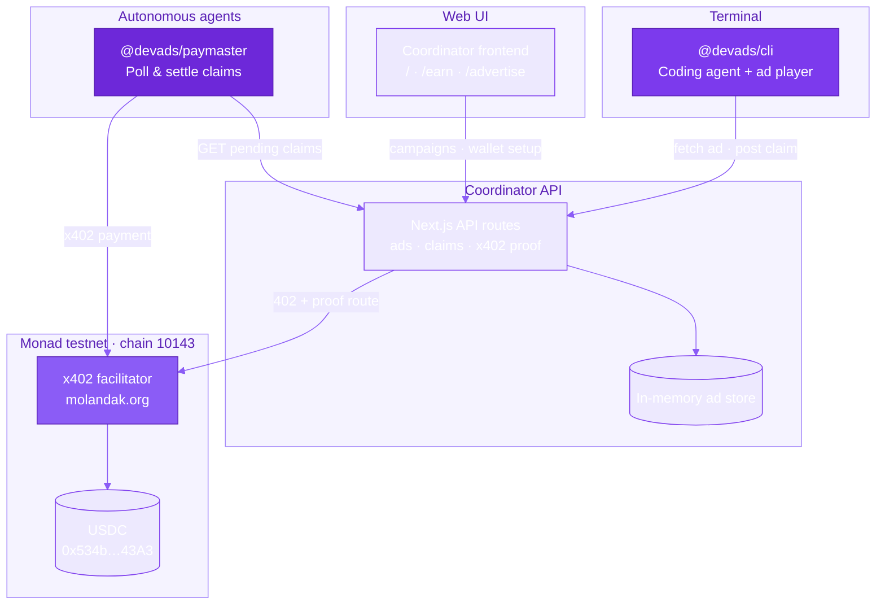
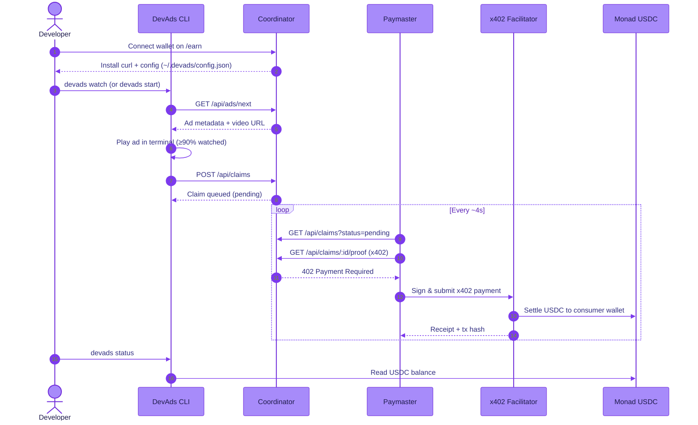
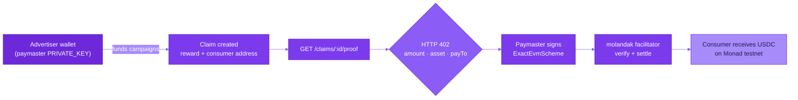
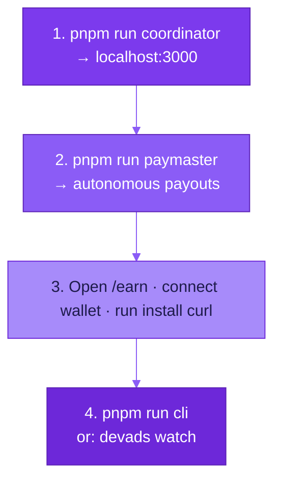

# DevAds

**A coding agent that pays you in USDC for the ads you watch — settled autonomously over x402 on Monad testnet.**

DevAds is a terminal-native earn-as-you-watch platform built for [Monad Blitz Mumbai](https://github.com/monad-developers/monad-blitz-mumbai). Developers run a Claude-powered coding CLI that plays short video ads between agent turns. When a watch is verified, an autonomous paymaster settles USDC rewards on-chain via the [x402](https://x402.org) payment protocol — no clicks, no manual payouts, no humans in the loop.

---

## What it does

| Role | Experience |
|------|------------|
| **Developer / watcher** | Connect a wallet, install the CLI, and earn USDC while coding. Ads play in the terminal; verified watches create on-chain claims. |
| **Advertiser** | Launch campaigns through the web UI. Each verified watch is paid from a funded wallet by the paymaster agent. |
| **Paymaster agent** | Polls pending claims and settles them over x402 using the molandak facilitator (gas included). |

---

## Architecture



---

## Earn flow



---

## x402 settlement

Payments use the **exact** x402 scheme (`@x402/core` v2.16). The coordinator returns HTTP 402 on proof routes; the paymaster signs EIP-3009 USDC authorizations and the public facilitator verifies and settles — covering gas on Monad testnet.



---

## Monorepo layout

```
devads/
├── apps/
│   ├── cli/           # Terminal coding agent + ad player (Claude Agent SDK)
│   ├── coordinator/   # Next.js web UI + REST/x402 API (port 3000)
│   └── paymaster/     # Autonomous claim settlement loop
├── packages/
│   └── shared/        # Chain config, USDC helpers, shared types
└── .env               # PRIVATE_KEY, ANTHROPIC_API_KEY, etc.
```

| Package | Description |
|---------|-------------|
| `@devads/cli` | `devads start` — coding REPL with ad breaks; `devads watch` — earn loop only; `devads status` — on-chain balance |
| `@devads/coordinator` | Campaign management, ad delivery, claim queue, x402 proof endpoints, install scripts |
| `@devads/paymaster` | Polls pending claims and pays them via x402 without human intervention |
| `@devads/shared` | Monad testnet chain ID `10143`, USDC address, facilitator URL, viem helpers |

---

## Tech stack

- **Chain:** [Monad testnet](https://monad.xyz) (chain ID `10143`)
- **Payments:** [x402](https://x402.org) exact scheme via `@x402/core`, `@x402/evm`, `@x402/fetch`, `@x402/next`
- **Facilitator:** `https://x402-facilitator.molandak.org` (gas sponsored)
- **Token:** USDC `0x534b2f3A21130d7a60830c2Df862319e593943A3` (6 decimals)
- **Agent:** Claude Agent SDK (coding CLI)
- **Runtime:** Node ≥20, pnpm workspaces

---

## Getting started

### Prerequisites

- Node.js ≥20 and [pnpm](https://pnpm.io)
- [ffmpeg / ffplay](https://ffmpeg.org) for terminal video playback
- A wallet funded with **Monad testnet USDC** ([Circle faucet](https://faucet.circle.com) → select Monad testnet)
- Optional: `ANTHROPIC_API_KEY` for the full coding agent (earn loop works without it)

### Install

```bash
pnpm install
```

### Environment

Create a `.env` at the repo root:

```env
PRIVATE_KEY=0x…          # Paymaster / advertiser wallet (must hold USDC)
PAY_TO_ADDRESS=0x…      # Optional: address to watch for incoming payouts
ANTHROPIC_API_KEY=sk-…   # Optional: only for devads start (coding REPL)
```

### Run the demo



**Terminal 1 — Coordinator (API + web UI)**

```bash
pnpm run coordinator
```

**Terminal 2 — Paymaster**

```bash
pnpm run paymaster
```

**Browser — Set up your wallet**

1. Open [http://localhost:3000/earn](http://localhost:3000/earn)
2. Connect wallet and run the generated install command (writes `~/.devads/config.json`)

**Terminal 3 — Start earning**

```bash
pnpm run cli              # Full coding agent + ad breaks (needs ANTHROPIC_API_KEY)
# or
pnpm --filter @devads/cli watch   # Earn loop only — no API key required
```

**Check balance**

```bash
pnpm --filter @devads/cli status
```

---

## API overview

| Endpoint | Method | Description |
|----------|--------|-------------|
| `/api/ads/next` | GET | Next ad for the CLI player |
| `/api/ads` | GET / POST | List or create campaigns |
| `/api/ads/:id/video` | GET | Stream ad video |
| `/api/claims` | GET / POST | List or create watch claims |
| `/api/claims/:id/proof` | GET | x402-gated proof route (triggers settlement) |
| `/api/balance` | GET | USDC balance for a wallet |
| `/api/smoke` | GET | x402 smoke test (returns 402) |

---

## Monad Blitz submission

This repo is a fork of the [monad-blitz-mumbai](https://github.com/monad-developers/monad-blitz-mumbai) template. To submit:

1. Fork the [monad-blitz-mumbai](https://github.com/monad-developers/monad-blitz-mumbai) repo under your project name.
2. Replace the template contents with this codebase and update this README with your demo link.
3. Follow the hackathon submission checklist in the upstream repo.

---

## License

Private — Monad Blitz Mumbai hackathon project.
